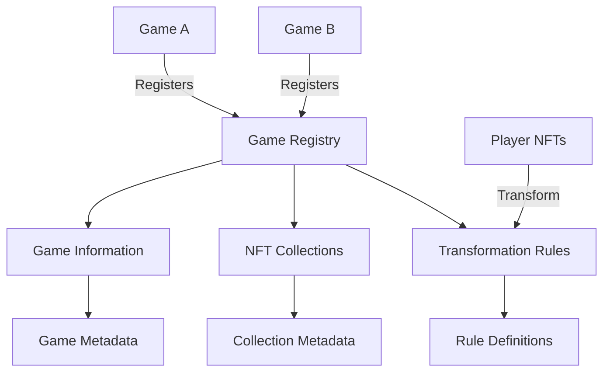

# GameWeave NFT Interoperability Platform

GameWeave is a platform that enables NFT assets to be used across multiple games and applications in the Stacks ecosystem. It creates a standardized way for game developers to recognize NFTs from other games and translate their properties into meaningful in-game assets or abilities.

## Overview

GameWeave bridges different gaming experiences by establishing a common protocol layer where games can:
- Register their NFT collections
- Define transformation rules for NFT usage across games
- Automatically recognize and translate NFTs from other games
- Create interconnected gaming experiences

For example, a sword NFT from Game A could become a special weapon in Game B or grant unique abilities in Game C, all managed through GameWeave's transformation rules.

## Architecture

GameWeave consists of a central registry contract that manages:
1. Game registrations
2. NFT collection registrations
3. Transformation rules
4. Cross-game asset recognition



## Contract Documentation

### GameWeave Registry Contract

The core contract (`gameweave-registry.clar`) manages the entire platform's functionality.

#### Key Components:

1. **Games Registry**
   - Stores game information and ownership
   - Tracks registered games with metadata

2. **NFT Collections**
   - Links collections to games
   - Stores collection metadata and contract addresses

3. **Transformation Rules**
   - Defines how NFTs transform between games
   - Manages rule permissions and updates

#### Access Control

- Game registration: Open to anyone
- Collection registration: Limited to game owners
- Rule creation: Limited to target game owners
- Updates: Limited to respective owners

## Getting Started

### Prerequisites

- Clarinet
- Stacks wallet for deployment

### Basic Usage

1. **Register a Game**
```clarity
(contract-call? .gameweave-registry register-game 
    "My Game" 
    "Game description" 
    (some "https://metadata.uri"))
```

2. **Register an NFT Collection**
```clarity
(contract-call? .gameweave-registry register-collection
    game-id
    collection-principal
    "Collection Name"
    "Collection description"
    (some "https://metadata.uri"))
```

3. **Create a Transformation Rule**
```clarity
(contract-call? .gameweave-registry create-transformation-rule
    source-collection-id
    target-game-id
    "transform-type"
    "rule-data"
    (some "https://metadata.uri"))
```

## Function Reference

### Administrative Functions

```clarity
(register-game (name (string-ascii 64)) 
               (description (string-utf8 256)) 
               (metadata-uri (optional (string-utf8 256))))
               
(register-collection (game-id uint) 
                    (contract-address principal) 
                    (name (string-ascii 64)) 
                    (description (string-utf8 256)) 
                    (metadata-uri (optional (string-utf8 256))))
                    
(create-transformation-rule (source-collection-id uint) 
                          (target-game-id uint) 
                          (rule-type (string-ascii 32)) 
                          (rule-data (string-utf8 1024)) 
                          (metadata-uri (optional (string-utf8 256))))
```

### Read Functions

```clarity
(get-game (game-id uint))
(get-collection (collection-id uint))
(get-transformation-rule (rule-id uint))
(is-nft-usable (collection-id uint) (token-id uint) (game-id uint))
```

## Development

### Local Testing

1. Clone the repository
2. Install Clarinet
3. Run tests:
```bash
clarinet test
```

### Deployment

1. Build the contract:
```bash
clarinet build
```

2. Deploy using Clarinet console or Stacks wallet

## Security Considerations

### Limitations

- Maximum 20 collections per game
- Maximum 20 rules per collection-game pair
- String length limitations for names and descriptions

### Best Practices

1. **Access Control**
   - Always verify game ownership before modifications
   - Validate all input parameters

2. **Data Validation**
   - Check existence of games/collections before creating rules
   - Verify rule data format and content

3. **Integration**
   - Implement proper error handling
   - Monitor transformation rule execution

4. **Updates**
   - Test rule changes thoroughly before deployment
   - Maintain clear documentation of transformation rules